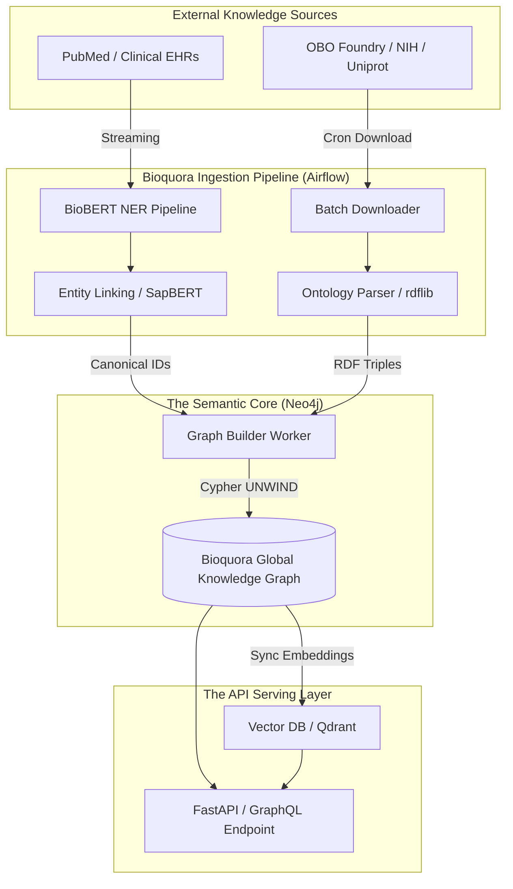

# Volume I: Biomedical Semantic Layer & Knowledge Representation

## Chapter 10: Semantic Implementation & Architecture

This chapter outlines the complete technical execution of Step 1: The Bioquora Semantic Architecture. It defines precisely how the theoretical models, ontological schemas, and NLP pipelines from Chapters 1-9 are physically deployed as robust code within the Bioquora platform.

### 10.1 The Master Semantic Architecture Flow

### 10.2 The Ontology Pipeline (Python & Airflow)
The semantic pipeline is responsible for constructing and maintaining the graph. Because biology evolves daily, the pipeline is executed via **Apache Airflow DAGs** on a strict weekly schedule to ensure Bioquora is never utilizing outdated medical science.

*   **`ingest_umls.py`**: A specialized Python worker that downloads the massive UMLS `.RRF` (Rich Release Format) files. It extracts the core Concept Unique Identifiers (CUIs), associated lexical strings, and hierarchical relationships, seeding the base nodes of the Neo4j graph.
*   **`ingest_obo.py`**: A highly generalized parser utilizing the `pronto` Python library. It targets the Disease Ontology (DOID), Gene Ontology (GO), and Human Phenotype Ontology (HPO) `.obo` files, rapidly extracting Terms and `is_a` taxonomic hierarchies.
*   **The Graph Builder Module**: A high-throughput ingestor utilizing the official `neo4j` Python driver. Instead of executing millions of individual `CREATE` statements (which would take weeks), the Graph Builder batches data into massive JSON dictionaries and passes them to parameter-driven `UNWIND` Cypher queries, upserting tens of thousands of nodes and edges per second.

### 10.3 Version Control for Knowledge (Time-Travel)
In standard software, code is versioned in Git. In Bioquora, **knowledge must also be versioned**. 
If a Bioquora AI Agent makes a critical diagnostic recommendation on March 1st based on the state of the graph, and the graph subsequently updates on March 5th (refuting the old knowledge), the system must maintain absolute auditability. The platform must be able to recreate the state of the graph *exactly as it was* on March 1st.

**The Timestamp Architecture:**
*   Bioquora achieves this without duplicating the database by appending `valid_from` and `valid_until` timestamp properties to every single Node and Edge.
*   When an edge is updated, or refuted by newly ingested science, it is **never deleted**. Instead, it is tombstoned by setting `valid_until = CURRENT_TIMESTAMP()`.
*   The GraphQL API queries accept an optional `?timestamp=` parameter. If provided by an auditor, the API dynamically injects a Cypher filter: `WHERE edge.valid_from <= $ts AND edge.valid_until > $ts`. This enables complete Time-Travel queries across the biological knowledge base.

### 10.4 The API Serving Layer
To expose the immense power of the Semantic Layer to the React frontend (the Digital Twin dashboards) and external AI Copilots, Bioquora deploys a unified, high-performance API.

*   **Technology Stack:** The API is built in Python using **FastAPI** to leverage extremely high-throughput, asynchronous endpoints.
*   **GraphQL Integration (Strawberry):** REST APIs suffer from severe over-fetching and under-fetching when dealing with highly connected graph data. Bioquora utilizes GraphQL to solve this. A single GraphQL query from the frontend can request: *"Fetch patient X, retrieve all their mutated genes, traverse to the pathways those genes disrupt, and return all Phase III approved drugs targeting those pathways"* in a single, deeply nested network call.

---
*End of Volume I. The semantic and philosophical foundation is now mathematically and technically defined. Volume II will detail the massive Big Data infrastructure required to scale this platform to global production.*
